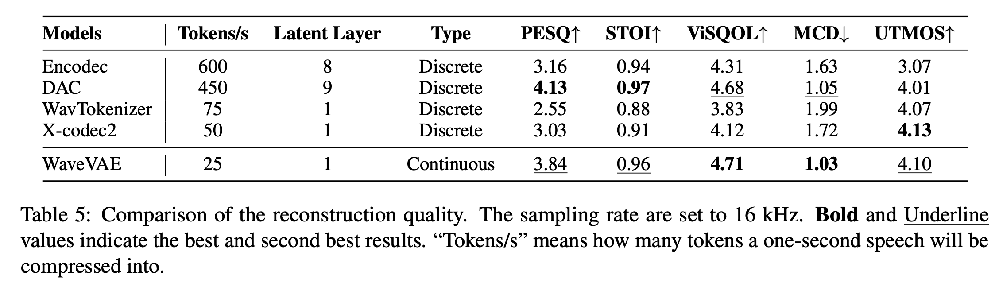

# AI Podcast

这是一个基于MegaTTS3的博客音频生成工具，可以将Markdown文档转换为播客风格的音频。

## 项目结构

本项目主要包含两个核心模块：

1. **播客稿生成模块**
   - 读取Markdown文档
   - 使用大语言模型将文档转换为适合朗读的播客稿
   - 优化文本结构和表达方式

2. **音频生成模块**
   - 基于MegaTTS3进行文本到语音的转换
   - 支持多种语音风格和情感表达
   - 生成高质量的播客音频

## 致谢

本项目基于以下开源项目：

- [MegaTTS3](https://github.com/bytedance/MegaTTS3) - 由字节跳动和浙江大学开发的零样本语音合成模型
- 感谢原项目团队在语音合成领域做出的杰出贡献


## Installation
``` sh
# Clone the repository
git clone https://github.com/Tom-0727/ai_podcast.git
cd ai_podcast
```
**Requirements (for Linux)**
``` sh

# Create a python 3.10 conda env (you could also use virtualenv)
conda create -n megatts3-env python=3.10
conda activate megatts3-env
pip install -r requirements.txt

# Set the root directory
export PYTHONPATH="/home/tom/codes/MegaTTS3:$PYTHONPATH"

# [Optional] Set GPU
export CUDA_VISIBLE_DEVICES=0

# If you encounter bugs with pydantic in inference, you should check if the versions of pydantic and gradio are matched.
# [Note] if you encounter bugs related with httpx, please check that whether your environmental variable "no_proxy" has patterns like "::"
```


**Model Download**

The pretrained checkpoint can be found at [Google Drive](https://drive.google.com/drive/folders/1CidiSqtHgJTBDAHQ746_on_YR0boHDYB?usp=sharing) or [Huggingface](https://huggingface.co/ByteDance/MegaTTS3). Please download them and put them to ``./checkpoints/xxx``.

> [!IMPORTANT]  
> For security issues, we do not upload the parameters of WaveVAE encoder to the above links. You can only use the pre-extracted latents from [link1](https://drive.google.com/drive/folders/1QhcHWcy20JfqWjgqZX1YM3I6i9u4oNlr?usp=sharing) for inference. If you want to synthesize speech for speaker A, you need "A.wav" and "A.npy" in the same directory. If you have any questions or suggestions for our model, please email us.
> 
> This project is primarily intended for academic purposes. For academic datasets requiring evaluation, you may upload them to the voice request queue in [link2](https://drive.google.com/drive/folders/1gCWL1y_2xu9nIFhUX_OW5MbcFuB7J5Cl?usp=sharing) (within 24s for each clip). After verifying that your uploaded voices are free from safety issues, we will upload their latent files to [link1](https://drive.google.com/drive/folders/1QhcHWcy20JfqWjgqZX1YM3I6i9u4oNlr?usp=sharing) as soon as possible.
> 
> In the coming days, we will also prepare and release the latent representations for some common TTS benchmarks.

## Inference

**Command-Line Usage (Standard)**
``` bash
# p_w (intelligibility weight), t_w (similarity weight). Typically, prompt with more noises requires higher p_w and t_w
python tts/infer_cli.py --input_wav 'assets/Chinese_prompt.wav'  --input_text "另一边的桌上,一位读书人嗤之以鼻道,'佛子三藏,神子燕小鱼是什么样的人物,李家的那个李子夜如何与他们相提并论？'" --output_dir ./gen

# As long as audio volume and pronunciation are appropriate, increasing --t_w within reasonable ranges (2.0~5.0)
# will increase the generated speech's expressiveness and similarity (especially for some emotional cases).
python tts/infer_cli.py --input_wav 'assets/English_prompt.wav' --input_text 'As his long promised tariff threat turned into reality this week, top human advisers began fielding a wave of calls from business leaders, particularly in the automotive sector, along with lawmakers who were sounding the alarm.' --output_dir ./gen --p_w 2.0 --t_w 3.0
```
**Command-Line Usage (for TTS with Accents)**
``` bash
# When p_w (intelligibility weight) ≈ 1.0, the generated audio closely retains the speaker's original accent. As p_w increases, it shifts toward standard pronunciation. 
# t_w (similarity weight) is typically set 0–3 points higher than p_w for optimal results.
# Useful for accented TTS or solving the accent problems in cross-lingual TTS.
python tts/infer_cli.py --input_wav 'assets/English_prompt.wav' --input_text '这是一条有口音的音频。' --output_dir ./gen --p_w 1.0 --t_w 3.0

python tts/infer_cli.py --input_wav 'assets/English_prompt.wav' --input_text '这条音频的发音标准一些了吗？' --output_dir ./gen --p_w 2.5 --t_w 2.5
```

**Web UI Usage**
``` bash
# We also support cpu inference, but it may take about 30 seconds (for 10 inference steps).
python tts/gradio_api.py
```

## Submodules
> [!TIP]
> In addition to TTS, some submodules in this project may also have additional usages.
> See ``./tts/frontend_fuction.py`` and ``./tts/infer_cli.py`` for example code.

### Aligner
**Description:** a robust speech-text aligner model trained using pseudo-labels generated by a large number of MFA expert models.

**Usage**: 1) Prepare the finetuning dataset for our model; 2) Filter the large-scale speech dataset (if the aligner fails to align a certain speech clip, it is likely to be noisy); 3) Phoneme recognition; 4) Speech segmentation.

### Graphme-to-Phoneme Model
**Description:** a Qwen2.5-0.5B model finetuned for robust graphme-to-phoneme conversion.

**Usage**: Graphme-to-phoneme conversion.

### WaveVAE
**Description:** a strong waveform VAE that can compress 24 kHz speeche into 25 Hz acoustic latent and reconstruct the original wave almost losslessly.

**Usage:** 1) Acoustic latents can provide a more compact and discriminative training target for speech synthesis models compared to mel-spectrograms, accelerating convergence; 2) Used as acoustic latents for voice conversion; 3) High-quality vocoder.

<div style='width:100%;text-align:center'>

</div>

## License

本项目基于 [Apache License 2.0](LICENSE) 开源许可证发布。使用本项目时，您需要：

1. 保留原始版权声明
2. 包含 Apache License 2.0 的副本
3. 如果修改了代码，需要明确标注修改内容
4. 保留所有原始版权、专利、商标和归属声明

本项目基于 [MegaTTS3](https://github.com/bytedance/MegaTTS3) 开发，同样遵循 Apache License 2.0 许可证。

